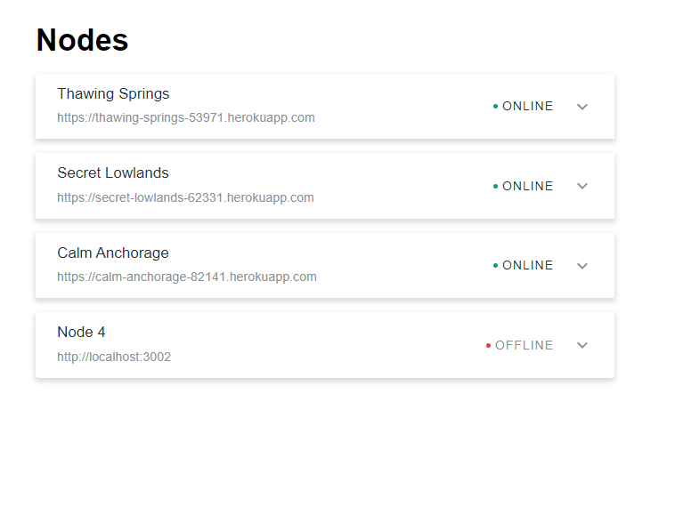

# Server Status

**Technologies:**

- Typescript
- Redux Toolkit
- Redux Thunks
- Material UI

## Installation

1. `git clone repo`
2. `cd toy-blocks-client-react`
3. `nvm use`
4. `npm install`

## Start 

1. `npm start`
